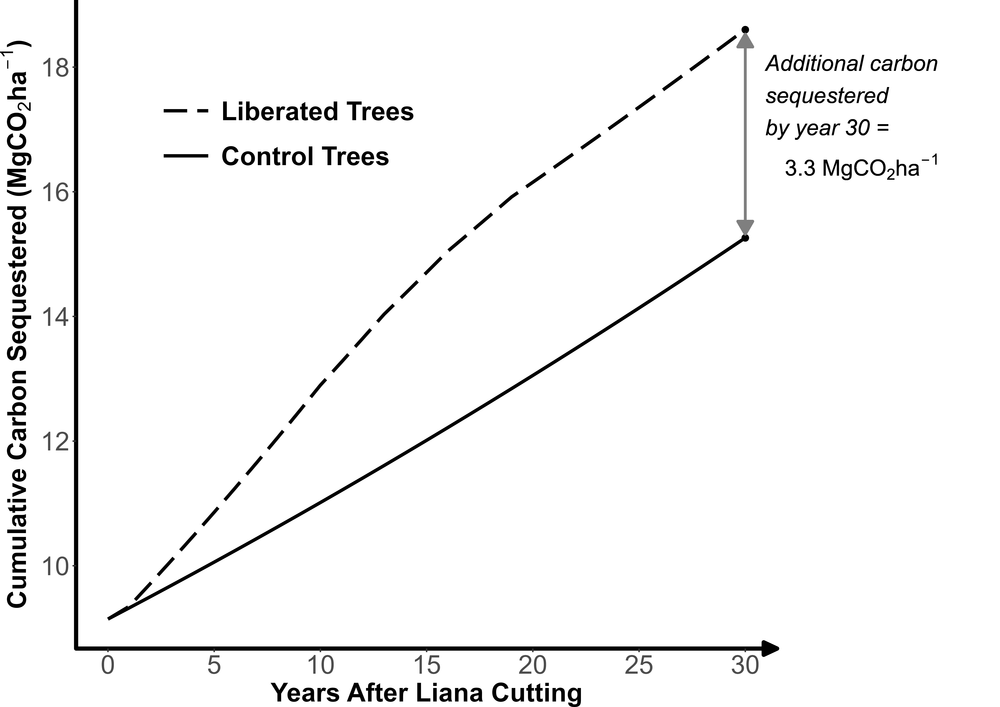

# Liana cutting in selectively logged forests increases both carbon sequestration and timber yields
**Francis E. Putz, Denver T. Cayetano, Ethan P. Belair, Peter W. Ellis, Anand Roopsind, Bronson Griscom, Catherine Finlayson, Alex Finkral, and Claudia Romero**
***

**Abstract:**
\
Infestations of trees by woody climbing plants (i.e., lianas) are common and increasing in an estimated 250 Mha of the 1 billion hectares of mixed-species tropical and temperate forest subjected to selective logging. Cutting lianas that impede the growth of future crop trees (FCTs) in these forests would sequester carbon at low cost and increase timber yields. We estimate that over 30 years if this treatment were applied to five liana-infested FCTs per hectare across the 250 Mha of selectively logged forest would result in 0.8 PgCO2 of additional carbon removals by the liberated trees at a direct cost of well less than $1.00 MgCO2-1. The same treatment could also be applied in forests not destined for logging where liana infestations were exacerbated by prior anthropogenic disturbances. If the numbers of trees liberated from lianas is kept small, undesired impacts on biodiversity will be minimized. 
\
\

_Fig. 2. Projected carbon benefits per hectare from cutting the lianas on 5 liana-infested future crop trees (FCTs; dashed line), compared to baseline growth of 5 FCTs which are liana infested and remain so (solid line). We assume that each tree is initially 40 cm DBH, 25 m tall, with a wood density of 0.5 g cm-3 and DBH increments of 0.4 cm per annum. All 10 trees were initially infested with three lianas (2, 3, and 4 cm DBH). To estimate biomass, we use the pantropical allometric equation for trees from Chave et al. (2014) and for lianas from Schnitzer et al. (2006), a root:shoot biomass ratio of 0.235 (Mokany et al., 2016), and a biomass-to-carbon ratio of 0.47 (IPCC, 2006). In response to liana cutting, the DBH increments of liberated trees doubles for 10 years and then asymptotically returns to the pre-treatment rate at year 20; the slow initial treatment effect in part reflects the carbon released from the cut lianas._

